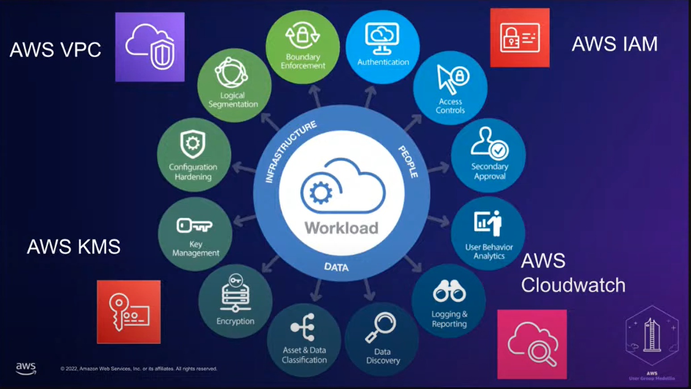

# Protegiendo tu infrastructura - Mejores Prácticas de seguridad en la nube con AWS

> **Nota:** Toda información aquí es copiada de una charla hecha en la comunidad** AWS User Group Medellín** por el speaker **Leonardo Baron**.
> Pedí el permiso correspondiente para poder poner la información aquí en el repositorio de nuestra comunidad.
> - [Redes sociales de la comunidad AWS User Group Medellín](https://linktr.ee/awsugmed "Redes sociales de la comunidad AWS User Group Medellín")
> - [Link de la charla en Yotube](https://www.youtube.com/watch?v=tqEolntK4qg&t=2s "Link de la charla en Yotube")

## Contenido de la charla:
- Principios básicos de seguridad en la nube.
- Desafíos de seguridad en la nube.

### Principios básicos de seguridad en la nube:

En el medio podemos ver que hay treas áreas generales, y que para cada una de estas áreas tenemos servicios de AWS especializados en abordarlas:
- **Área de personas:**
	- **Authentication:** habilidad que tiene un sistema de **identificar y reconocer identidades**(personas, sistemas, servicios, cargas de trabajo).
	- **Access Controls:** va un poco más allá de las identidades, es cómo se tiene control del control de acceso al sistema, hace referencia a: **Qué acciones puede hacer, cierta identidad dentro de mi sistema**.
	- Secondary approval: básciamente es que una identidad tengan permisos para hacer cualquier acción, pero esa acción no siempre tiene que ser una acción total, puede ser una acción parcial, que necesite de segunda aprobación para poder terminar de realizarla.
	Estos tres conceptos se nos hacen posible a través del servicio AWS IAM(Identity Access and Management)
- Áreas de datos:
	- User Behavior Analytics: hace referencia a las analíticas del comportamiento de usuario, monitorear cómo se comporta un usuario dentro de nuestra aplicación y podemos ver en qué áreas hay oportunidades de mejora y cómo podemos hacerlo.
	- Logging & Reporting: cómo se comportan nuestras cargas de trabajo, si están haciendo bien las cosas, si están fallando, si están tomando más tiempo del necesario, y entre muchas otras cosas que podemos monitorear en nuestras cargas de trabajo.
	- Data Discover: descubrir mucha cantidad de data, para poder monitorearla y analizarla.
	- Asset & Data Classification: si se tienen muchos datos, se puede tener la flexibilidad para poder organizar y clasificar los datos como se quiera y se necesite. También puedes asegurar cierta data que consideres importante.
Estos tres conceptos se nos hacen posible a través del servicio AWS CloudWatch, nos permite descubrir la data, loggings, hacer reportes de cómo se manejan nuestras cargas de trabajo, sacar métricas, entre otras funcionalidades.
	- Encryption: para poder cifrar algo, necesito una llave para poder cifrarlo. Se puede cifrar la data en reposo y en tránsito.
	- Key Management:
Para administrar, crear, compartir llaves, podemos usar KMS (Key Management System)

- Áreas de infrastructura
	- Configuration Hardening: cada uno de los recursos que creamos en un ambiente en cloud, debemos configurarlos de manera correcta para que funcione como queremos, y esperamos, de manera segura. Es muy importante saber qué configraciones tenemos disponibles en nuestros recursos, saber cómo funcionan cada una de las configuraciones, y saber cuáles son las que nos sirven para nuestros casos de uso
	- Logical Segmentation: una red se compone de subredes, y estas subredes buscamos que se segmenten lógicamente, es decir, que los elementos que estén relacionados estén sobre la misma subred, para tener una infrastructura segura.
	- Boundary Enforcement: enforcamiento de barreras, queremos que nuestro sistema tenga barreras, y que sólo pueda hacer lo que necesite hacer (Principio de menor privilegio).
AWS Config nos permite haer una configuración general, y hacer que esa configuracion general varios recursos la usen (configuration hardening).
AWS VPC nos permite crear una red privada, en una nube de AWS y configurarla de la manera que necesitemos.

### Desafíos de seguridad en la nube:

